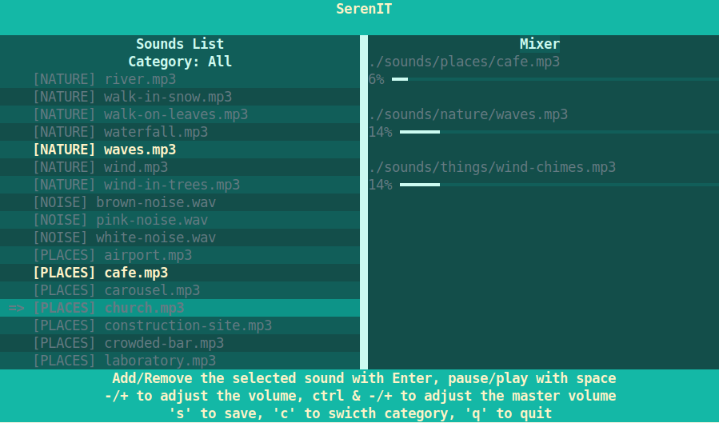

# SerenIT

Desktop Ambient Sound Player coded in Rust

Inspired by the [Moodist App](https://github.com/remvze/moodist) 

## Authors

- [@elevenjune](https://www.github.com/elevenjune)

## Screenshots

## Features

- Use arrows ↓↑ to select a sound
- Use arrow  ← to unselect
- 'c' to switch between categories
- Add/Remove the selected sound with Enter
- Pause/play with space
- +/- to adjust the volume
- ctrl +/- to adjust the master volume
- 's' to save (to ~/.config/serenIT)
- 'q' to quit
