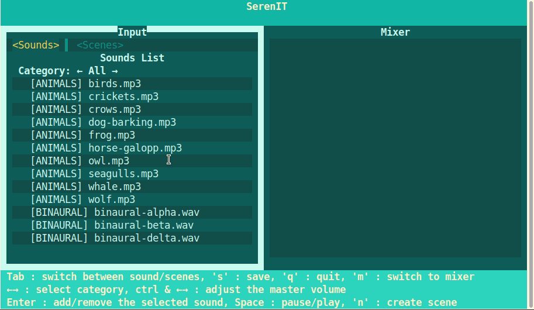

# SerenIT

Desktop Ambient Sound Player coded in Rust

Inspired by the [Moodist App](https://github.com/remvze/moodist) 

## Authors

- [@elevenjune](https://www.github.com/elevenjune)

## Demo

## Features

- Play ambient sounds together  
- You can adjust the volume of each sound separately or the master volume
- A group of playing sounds is called a scene
- You can create several scenes and witch between them
- All will be saved in ~/.config/serenIT

## Controls

General Controls :
- Tab: Switch between sounds and scenes.
- s: Save your current configuration (to ~/.config/serenIT).
- q: Quit the application.
- Ctrl & ←→: Adjust the master volume.

Catalog Mode (when not in mixer mode):
This mode allows you to browse and select sounds from a catalog.
- ←→: Select a category.
- Enter: Add or remove the currently selected sound.
- Space: Pause or play the selected sound.
- m: Switch to mixer mode.
- n : create empty scene

Mixer Mode:
This mode focuses on managing sounds that are currently playing.
- ←→: Adjust the volume of the currently selected sound.
- Space: Pause or play the selected sound.
- Enter : remove the selected sound
- m: Go back to catalog mode.
